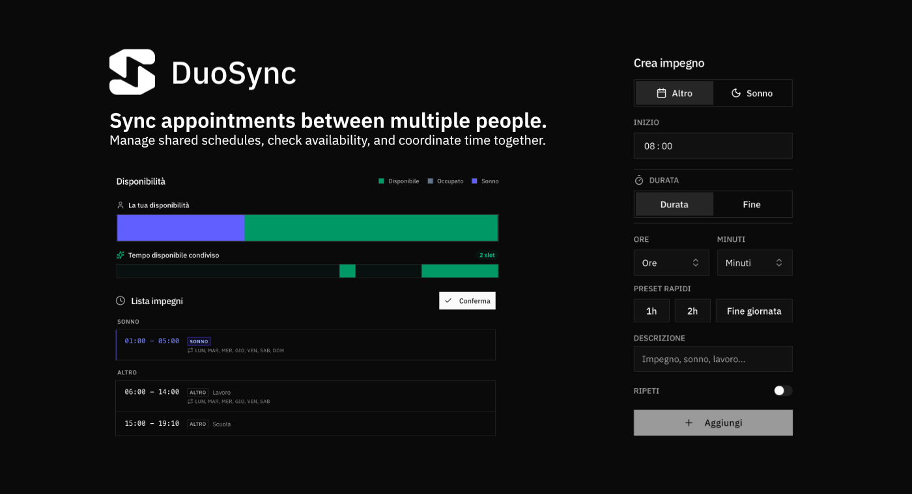

# DuoSync

DuoSync synchronizes appointments between multiple people. Manage shared schedules, check availability across users, and coordinate time together.



## Purpose

DuoSync solves the problem of coordinating schedules when multiple people need to align their commitments. Instead of manually comparing calendars or asking "when are you free?", DuoSync provides a unified view of everyone's availability.

**Use cases:**
- Families coordinating activities and appointments
- Small teams managing shared schedules
- Roommates organizing household commitments
- Groups planning events around everyone's availability

## Core Capabilities

### Appointment Synchronization
Create and manage appointments for multiple users. Each user maintains their own schedule while contributing to a shared availability view.

### Availability Checking
Visual timeline showing personal and shared availability with color-coded segments. Personal timeline displays all user appointments (sleep, other commitments, available time). Shared timeline highlights green segments when all users are free simultaneously, facilitating group activity planning.

### Recurring Appointments
Support for recurring appointments with flexible repeat patterns. Manage regular commitments efficiently.

### Multi-User Management
Switch between user profiles seamlessly. Each user has an independent schedule that contributes to the shared view.

### Real-Time Updates
Push notifications sent when a user explicitly confirms their appointments via the "Conferma" button. Notifications alert other users that availability has been updated, serving as reminders without requiring daily calendar updates.

## Architecture

### Feature-Based Organization

The codebase follows a feature-based architecture with strict separation of concerns:

```
duosync/
├── app/                    # Next.js App Router
│   ├── api/                # API routes (server-side)
│   │   ├── appointments/   # Endpoints per appuntamenti
│   │   ├── notifications/  # Endpoints per push notifications
│   │   └── users/          # Endpoints per utenti
│   ├── admin/              # Area amministrativa
│   ├── onboarding/         # Setup iniziale
│   └── page.tsx            # Dashboard principale
├── components/             # Componenti UI riutilizzabili
│   ├── dashboard/          # Componenti specifici dashboard
│   ├── header/             # Header con user switcher
│   ├── layout/             # Layout components
│   └── ui/                 # Radix UI components
├── features/               # Logica di business isolata
│   ├── appointments/       # Gestione appuntamenti
│   │   ├── services/       # Business logic pura
│   │   └── appointments-context.tsx
│   ├── availability/       # Calcolo disponibilità
│   │   └── services/
│   └── users/              # Gestione utenti
│       ├── services/
│       └── users-context.tsx
├── hooks/                  # Custom hooks riutilizzabili
│   ├── use-other-user-appointments.ts
│   ├── use-time-input-validation.ts
│   └── useNotifications.ts
├── lib/                    # Utilities e servizi
│   ├── db/                 # Database schema e connection
│   ├── time/               # Utility per gestione tempo
│   └── notifications/      # Servizio push notifications
├── types/                  # TypeScript types globali
│   └── index.tsx
└── i18n/                   # Traduzioni e context i18n
    ├── en.json
    └── it.json
```

### Design Principles

**Separation of Concerns**
- `app/`: Only Next.js entrypoints, no business logic
- `components/`: Presentational components receiving data via props/hooks
- `features/`: Domain logic in pure service functions, no UI dependencies
- `lib/`: Generic utilities with no component dependencies

**Service Layer Pattern**
Business logic is implemented as pure functions in `features/*/services/`:
- No side effects (except database operations)
- No UI dependencies
- Testable in isolation
- Reusable across client and server

**Barrel Exports**
Each feature exposes a public API through `index.ts`, preventing direct imports of internal implementation details. This enforces encapsulation and makes refactoring safer.

**Type Safety**
All domain types are centralized in `types/` and imported via `@/types` alias. TypeScript strict mode ensures compile-time safety across the application.

### State Management

**React Context Pattern**
Feature-specific state is managed through React Context providers:
- `AppointmentsProvider`: Manages appointments state, fetching, and mutations
- `UsersProvider`: Handles user list and active user selection
- `I18nProvider`: Manages locale and translations

**Custom Hooks**
Public API for each feature is exposed through custom hooks (`useAppointments`, `useUsers`, `useI18n`). Components never access context directly, ensuring consistent usage patterns.

**State Isolation**
Each feature's state is isolated. Context providers are keyed by user ID where appropriate, automatically resetting state when switching users. This prevents unnecessary re-renders and maintains performance.

**Optimistic Updates**
Updates are applied optimistically with automatic rollback on error, providing immediate feedback while maintaining data consistency.

**Local Persistence**
User preferences (active user, locale) are persisted in `localStorage` with proper SSR handling.

## Technology Stack

**Frontend:** Next.js 16.0.3 (App Router), React 19.2.0, TypeScript 5, Tailwind CSS 4, Radix UI, lucide-react 0.554.0  
**Backend:** PostgreSQL 16, Drizzle ORM 0.44.7, Node.js 20  
**Utilities:** dayjs 1.11.19, date-fns 4.1.0, sonner 2.0.7, next-themes 0.4.6  
**Infrastructure:** Docker Compose, Web Push API (web-push 3.6.7)

Key choices:
- **Drizzle ORM**: Type-safe queries with SQL-like syntax, zero runtime overhead
- **Radix UI**: Accessible headless components, full keyboard/ARIA support
- **Next.js App Router**: Server Components for performance, API routes for backend
- **Feature-based architecture**: Domain logic isolated from presentation, testable services

## Database Design

**Schema-First Approach**
Database schema defined in `lib/db/schema.ts` using Drizzle ORM. Migrations generated automatically via `drizzle-kit push`.

**Key Tables**
- `app_settings`: Singleton table for global configuration (admin PIN, initialization state)
- `users`: User profiles with names (id: serial PK)
- `appointments`: One-time appointments with date, startTime, endTime (HH:mm format), category (sleep/other), description (id: text PK)
- `recurring_appointments`: Recurring templates with repeatDays array (1-7), same time/category fields (id: text PK)
- `push_subscriptions`: Web Push subscriptions with endpoint, p256dh, auth keys (id: serial PK)

**Indexes**
- `appointments_userId_date_idx`: Optimized queries for userId + date
- `recurring_appointments_userId_idx`: Fast template lookups
- `push_subscriptions_userId_idx`: User subscription queries
- `push_subscriptions_endpoint_idx`: Unique endpoint lookups

**Connection Pooling**
PostgreSQL connection pool configured via `pg` library, reused across all database operations.

## API Design

**RESTful Endpoints**

Appointments:
- `GET /api/appointments?userId=1&date=2025-01-20`: Fetch appointments for user and date
- `GET /api/appointments/batch?userIds=1,2&date=2025-01-20`: Batch fetch for multiple users
- `GET /api/appointments/recurring?userId=1`: Fetch recurring templates
- `POST /api/appointments/add`: Create appointment
- `PUT /api/appointments/update`: Update appointment
- `POST /api/appointments/remove`: Delete appointment

Users:
- `GET /api/users`: List all users
- `POST /api/users`: Create user
- `PUT /api/users`: Update user
- `DELETE /api/users`: Delete user

Notifications:
- `GET /api/notifications/vapid-public-key`: Get VAPID public key
- `POST /api/notifications/subscribe`: Register push subscription
- `DELETE /api/notifications/subscribe`: Remove push subscription
- `POST /api/notifications/confirm`: Send notifications to other users

System:
- `POST /api/onboarding`: Initial app setup
- `POST /api/admin/login`: Admin area authentication

**Server/Client Separation**
API routes (`app/api/*`) use server-side database services. Client components use API endpoints via `fetch()`, never direct database access. Type safety maintained through shared TypeScript types. Validation performed both client-side (UX) and server-side (security).

**Documentation**
Postman collection in `/api-docs` documents all endpoints with request/response examples. Environment variables file included for easy testing.

## Additional Features

**Internationalization**
JSON-based translations (English, Italian) with `I18nProvider` context and `useI18n()` hook. Template variable interpolation supported (e.g., `{{name}}`). Locale preference persisted in localStorage with SSR handling.

**Progressive Web App**
Custom service worker (`/public/sw.js`) with network-first caching strategy and offline support. Web app manifest configured for standalone display mode. Install prompt available after onboarding. Push notifications handled via service worker.

**Push Notifications**
Web Push API integration with VAPID keys. Subscriptions stored per-user with endpoint uniqueness. Notifications sent only when user explicitly confirms appointments via "Conferma" button. Service worker handles notification display and click events.

**Timeline Algorithm**
Time points collected from all user appointments, segments created between consecutive points, category calculated based on each user's availability. Priority logic: sleep > other > match > available. Efficient calculation handles up to 10 users with real-time updates.

**Validation & Business Rules**
Time format validation (HH:mm), overlap detection for appointments, recurring appointments require at least one day selected, admin PIN must be 6 numeric digits, maximum 10 users enforced server-side. Slot validation suggests next available slot when conflicts detected.

**Development**
Docker Compose setup with zero-configuration. Files kept under ~200 lines with pure service functions. Strict TypeScript with no `any` types. Schema-first database migrations via Drizzle Kit.

---

**Status**: Under active development. For updates, visit [blog.vitoesposito.it](https://blog.vitoesposito.it).
